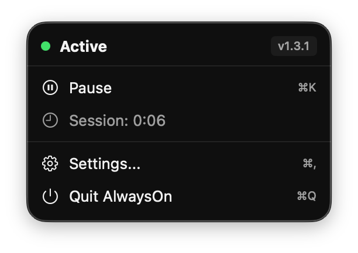
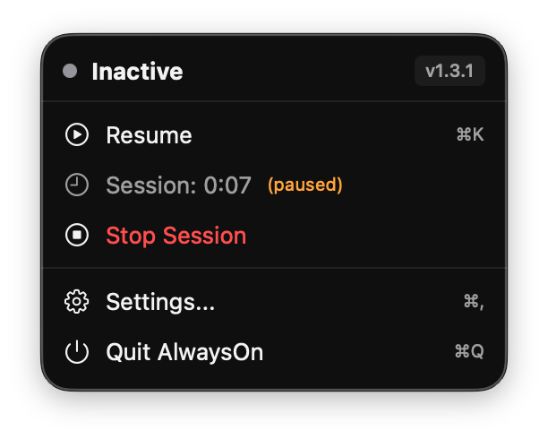
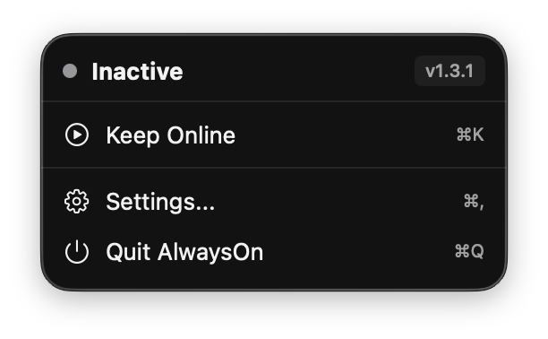
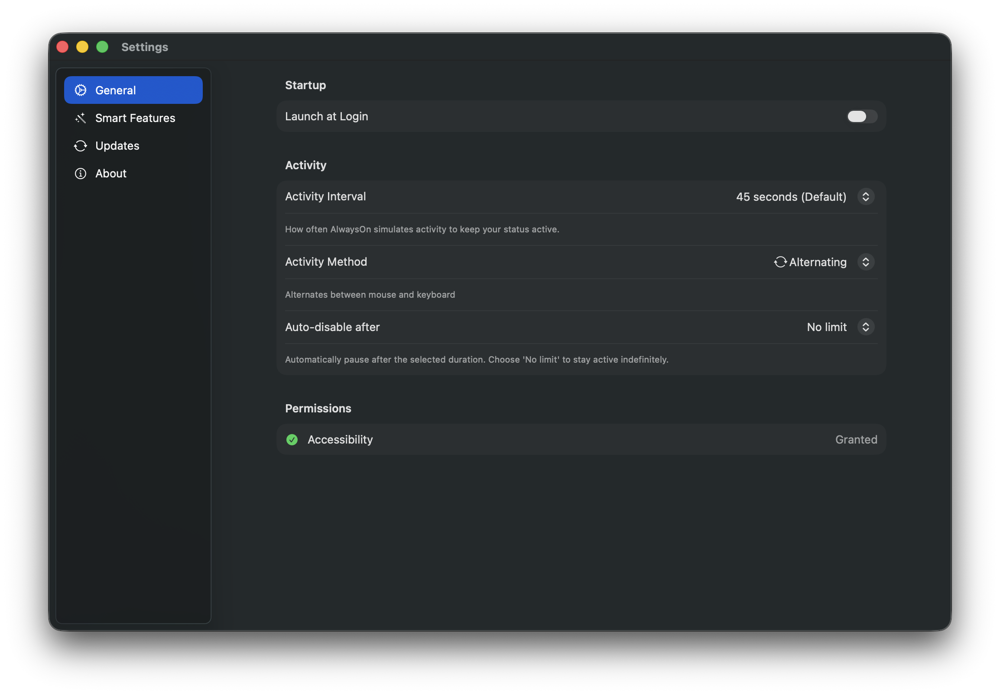
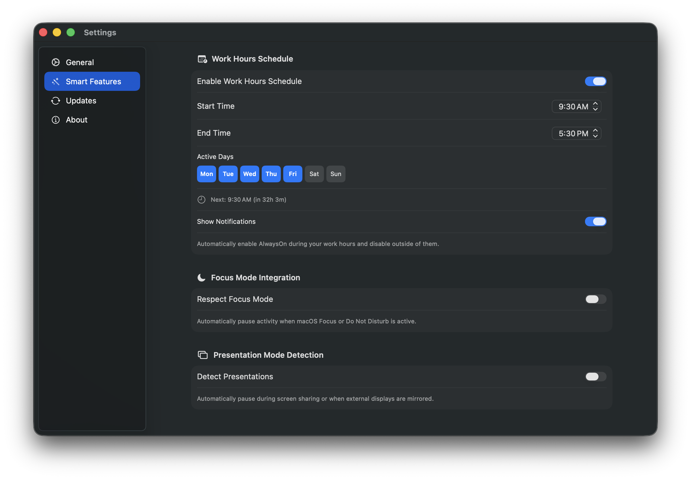
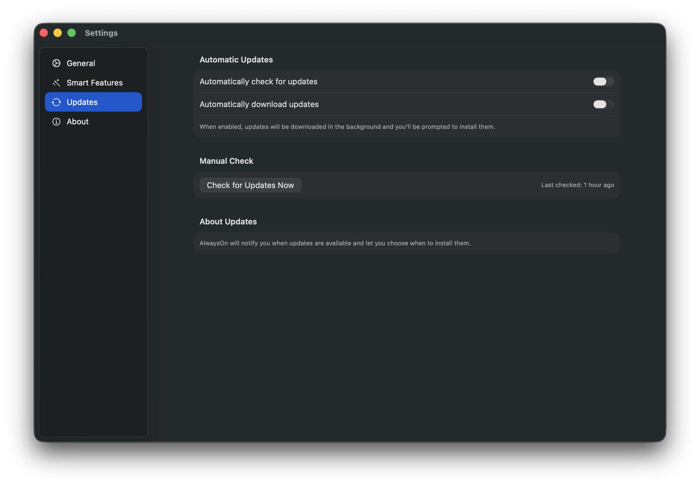

# AlwaysOn

A lightweight macOS menu bar app that keeps your status active in Microsoft Teams, Slack, Zoom, and other workplace apps by simulating minimal user activity.

If you find this app useful, consider supporting its development:

<a href="https://buymeacoffee.com/hafiezul" target="_blank"></a>

## Features

| Core | Advanced |
|------|----------|
| **Menu Bar Only** - No dock icon, lives in menu bar | **Work Hours** - Auto-enable/disable on schedule |
| **One-Click Toggle** - Start/stop instantly | **Focus Mode** - Respects Do Not Disturb |
| **Session Timer** - Track time "online" | **Presentation Detection** - Auto-pause during screen sharing |
| **Pause/Resume** - Pause without losing progress | **Quick Timers** - Auto-disable after 30min-8h |
| **Stop Session** - Reset completely | **Configurable Interval** - 30s to 5min timing |
| **Launch at Login** - Auto-start on boot | **Activity Methods** - Mouse, keyboard, or alternating |
| **Auto-Updates** - Sparkle-powered updates | **Schedule Notifications** - Alerts for work hours |
| **Settings Window** - Sidebar navigation | - |

## Roadmap

<details>
<summary><b>Completed</b> - Click to expand</summary>

**v1.2** - Configurable interval, quick timers, activity methods, pause/resume, stop session  
**v1.3** - Work hours scheduling, presentation detection, focus mode integration, notifications
</details>

<details>
<summary><b>Future Ideas</b> - Click to expand</summary>

- Homebrew Cask support, menu bar icon variations, session statistics, calendar integration
- Break reminders, multiple profiles, randomized intervals, URL scheme automation
- Shortcuts.app support, WiFi location awareness, native widgets, app-specific awareness, iCloud sync
</details>

**Funding Goal** - Apple Developer Program ($99/year) to properly sign the app  
*Have an idea? [Open an issue](../../issues/new) or [start a discussion](../../discussions)!*

## Requirements

- macOS 13.0 (Ventura) or later
- Accessibility permission (for input simulation)

## Installation

### Download Pre-built Binary (Recommended)

1. Download the latest release from the [Releases page](../../releases/latest):
   - **AlwaysOn-vX.X.X.dmg** - Drag and drop installer
   - **AlwaysOn-vX.X.X.zip** - Extract and move to Applications
2. Move `AlwaysOn.app` to your Applications folder
3. **First launch**: Right-click the app and select "Open" (required for unsigned apps)
4. **Run the installation helper script** (required for accessibility features):
   ```bash
   curl -fsSL https://raw.githubusercontent.com/hafiezul/AlwaysOn/main/install-helper.sh | bash
   ```
   Or download `install-helper.sh` from the repository and run:
   ```bash
   chmod +x install-helper.sh
   ./install-helper.sh
   ```
5. See [Granting Accessibility Permission](#granting-accessibility-permission) below for next steps

> **⚠️ Why the extra step?** macOS requires apps using accessibility features to be signed with an Apple Developer certificate ($99/year - that's a lot of coffee ☕). Since I can't afford that right now, the helper script re-signs the app locally on your machine. Takes 30 seconds and it's completely safe - this project is open source, so feel free to [inspect the script](install-helper.sh) before running it. If you'd rather skip it, just [build from source](#from-source) in Xcode!

### From Source

Building from source is the easiest way to get full accessibility features without extra steps:

1. Clone this repository
2. Open `AlwaysOn.xcodeproj` in Xcode 15+
3. Build and run (Cmd+R)
4. See [Granting Accessibility Permission](#granting-accessibility-permission) below for next steps

**Why build from source?** Apps built in Xcode are automatically signed with your local development certificate, so accessibility features work immediately without any manual re-signing.

### Granting Accessibility Permission

**First time setup:**
1. Click **"Keep Online"** or **"Grant Permission"** in the menu
2. macOS will show a permission prompt - click **"Open System Settings"**
3. In the Accessibility settings, enable **AlwaysOn**
4. Return to the app - it will automatically detect the permission

**Manual setup:**
1. Open **System Settings** > **Privacy & Security** > **Accessibility**
2. Click the **"+"** button and add AlwaysOn from your Applications folder
3. Ensure the checkbox next to AlwaysOn is enabled
4. Return to AlwaysOn - it will automatically detect the permission change

## Usage

### Menu Bar Interface

 



### Settings

 



### Keyboard Shortcuts

| Shortcut | Action |
|----------|--------|
| `⌘K` | Toggle Keep Online / Pause / Resume |
| `⌘,` | Open Settings |
| `⌘Q` | Quit AlwaysOn |

## How It Works

AlwaysOn simulates minimal user activity at a configurable interval (default: 45 seconds):

**Mouse Method (Default):**
1. Moves the cursor by 1 pixel
2. Immediately moves it back
3. Repeat

**Keyboard Method:**
1. Presses and releases the Shift key
2. Repeat

**Alternating Method:**
1. Alternates between mouse and keyboard methods
2. Provides variety in activity simulation

This prevents macOS from detecting you as "idle" and keeps workplace apps like Microsoft Teams, Slack, and Zoom showing your status as "Available" or "Active".

**Why these methods?**
- Workplace apps monitor system idle time
- Tiny mouse movements and key presses reset the idle timer
- Activity is imperceptible to users
- Uses native macOS APIs (no hacks)

## Updating the App

AlwaysOn checks for updates via Sparkle, but **automatic updates may not work** due to code signing limitations. Without an Apple Developer Program membership ($99/year), the app cannot be properly code signed, and macOS/Sparkle will reject unsigned updates as a security measure.

**To update manually:**

1. Visit the [Releases page](../../releases/latest)
2. Download the latest DMG or ZIP
3. Replace your existing app in the Applications folder
4. Re-run the [installation helper script](#download-pre-built-binary-recommended) if needed

> **Tip**: After updating, you may need to remove the old entry from Accessibility settings and re-add the new app. See Troubleshooting below.

## Privacy & Security

- **No network access** - App works entirely offline (except for update checks)
- **No data collection** - Nothing is tracked or sent
- **Open source** - Audit the code yourself
- **Minimal permissions** - Only Accessibility (required for input simulation)

## FAQ

### Why does it need Accessibility permission?

macOS requires Accessibility permission for any app that simulates keyboard or mouse input. This is a security feature to prevent malicious apps from controlling your computer.

### Will this affect my actual mouse usage?

No. The movement is 1 pixel and instantly reversed. You won't notice it.

### Does it work with Slack/Zoom/other apps?

Yes. AlwaysOn works with any app that monitors macOS system idle time, including Microsoft Teams, Slack, Zoom, Discord, and most workplace communication apps. However, some apps may have their own activity detection methods (like webcam monitoring) that this won't bypass.

### Does it prevent my Mac from sleeping?

No. AlwaysOn only simulates activity, it doesn't prevent sleep. If you want to prevent sleep, use a separate tool like `caffeinate`.

### Why isn't it in the App Store?

Apps that simulate input can't use App Sandbox, which is required for the Mac App Store.

### How do I make it start automatically?

Enable **"Launch at Login"** in the menu. This uses macOS's built-in Login Items feature.

## Troubleshooting

### App not keeping me online

1. Check that Accessibility permission is granted (see [Granting Accessibility Permission](#granting-accessibility-permission))
2. Ensure the status shows "Active" (green dot)
3. Verify your app isn't overriding with "Do Not Disturb" or custom status settings

### App doesn't appear in menu bar

1. Check if your menu bar is full (icons may be hidden)
2. Try relaunching the app
3. Check Activity Monitor for "AlwaysOn" process

### Accessibility not working after installation (DMG/ZIP)

If you installed from a pre-built DMG or ZIP and accessibility features aren't working, see the [installation helper instructions](#download-pre-built-binary-recommended) in step 4 of the installation section, then grant accessibility permission in System Settings.

### "Accessibility Required" warning won't go away

This typically happens after reinstalling or updating the app. macOS tracks permissions by app binary, so a new version appears as a different app.

**Why this happens:**
- macOS stores accessibility permissions per app binary
- When you reinstall, the old permission entry points to the old (deleted) binary
- The new app binary needs its own permission entry

**Solution:**
1. **Re-run the installation helper** (for DMG/ZIP installs) - see [installation instructions](#download-pre-built-binary-recommended)
2. Click **"Grant Permission"** in the app menu - this triggers the system prompt
3. If that doesn't work, click **"Open Settings..."** to go to Accessibility settings
4. **Remove the old entry**: Select "AlwaysOn" and click the **"-"** button
5. **Add the new app**: Click **"+"** and select AlwaysOn from your Applications folder
6. Ensure the checkbox is enabled
7. Return to the app - permission will be detected automatically

> **Tip**: The app automatically checks for permission changes when you switch back to it, and polls for 30 seconds after you open Settings.

### "Launch at Login" not working

1. Open **System Settings** > **General** > **Login Items**
2. Ensure AlwaysOn is listed and enabled
3. If not, toggle the option off and on again in the app menu

### Update check failed

1. Check your internet connection
2. Try again in a few moments
3. You can always download updates manually from the [Releases page](../../releases/latest)

## Building from Source

```bash
# Clone the repository
git clone https://github.com/hafiezul/AlwaysOn.git
cd AlwaysOn

# Open in Xcode
open AlwaysOn.xcodeproj

# Build and run
# Press Cmd+R in Xcode
```

### Build Requirements

- Xcode 15.0+
- macOS 13.0+ SDK
- Swift 5.9+

## License

MIT License - See [LICENSE](LICENSE) file for details.

## Contributing

Contributions are welcome! Please:

1. Fork the repository
2. Create a feature branch
3. Submit a pull request

## Acknowledgments

Inspired by the need to appear "available" while focusing on deep work.
